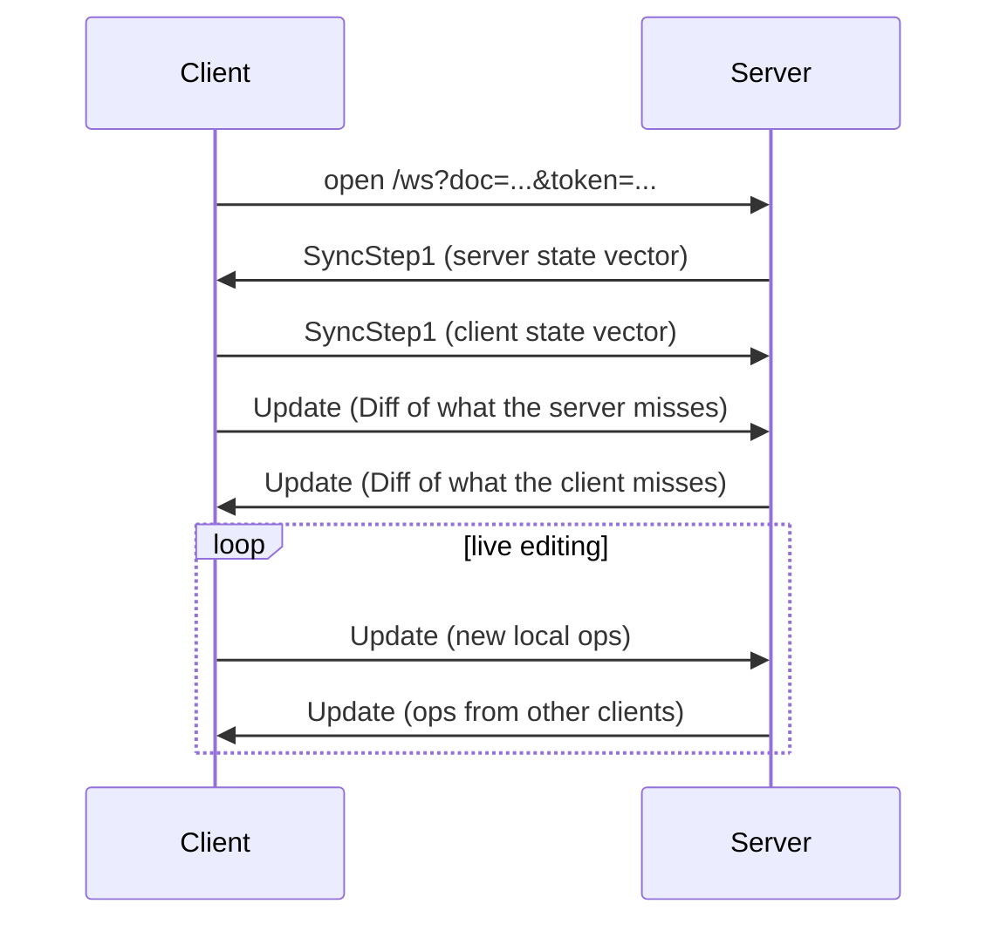

## 1. Concepts

`Client ID` is an unsigned 64-bit non zero integer. `0` is only used by the sentinels below, the server's own edits use `1`.
Every other client picks a random Client ID `N` at startup, where `2^20 <= N < 2^20 + 2^48`, which it holds for its lifetime including reconnects.
> `N` stays below `2^53`, so it is an exact number in JavaScript.

`ID = (client, clock)`. Each client counts its own operations from 0; every insert AND every delete uses one clock value.

Two sentinel values:
 - `START` = `(0, 0)`
 - `END` = `(0, 1)`

A document is a set of **containers**. A container is one of three kinds:
- **Text**: a sequence of codepoints
- **Array**: a sequence of values
- **Map**: string keys, each holding a value

A value is either JSON (a JSON text of at most 64 KiB) or a nested container of one of the three kinds.

A container is named in one of two ways, and that name is its **ref**:
- a **root** container has a name and a kind, ref `r:<kind>:<name>`, kind being `text`, `array` or `map`. The name may be empty and may contain `:`. `r:text:` is the default text, `r:map:slides` a Map called `slides`. The same name with a different kind is a different container.
- a **nested** container is created by an item whose content is a type, and is named by that item's ID, ref `i:<client>:<clock>` with both numbers in decimal. `i:1048577:42` is the container created by item `(1048577, 42)`. Client `0` is never a nested container.

Each sequence has its own `START` and `END`. A Text or an Array is one sequence. A Map has one sequence per key, so every key is an independent sequence.

Each `item` contains the following fields:
- id
- origin - its left neighbour when created
- rightOrigin - its right neighbour when created
- parent - the container it belongs to
- key - the map key, empty unless the parent is a Map
- content - one codepoint (Text), a JSON text, or a container kind (Array and Map)
- deleted flag
> Origins never change

There are two types of operations
```go
InsertOp {              DeleteOp {
    id,                     id,
    origin,                 target
    rightOrigin,        }
    parent,
    key,
    content
}
```
An insert with the zero parent, an empty key and a codepoint as content is the original single text: it is the same as an insert into `r:text:`.
Deletes are tombstones, meaning items are never really removed.
> Subject to change in the future

Positions count visible codepoints, starting at 0.

## 2. Local edits

Insert at position `p`:
- `origin` is the visible item at `p - 1`, or `START` if `p` is 0
- `rightOrigin` is the item directly to the right of `origin`, EVEN IF that item is deleted

Delete at position `p`:
- `target` is the visible item at `p`

Both take the next clock value of the client and are applied to its own document straight away.

An Array insert follows the same rules as a Text insert, inside the Array's own sequence. An Array delete is the same as a Text delete.

Map set of key `k`:
- `origin` is the LAST item of the sequence of `k`, even if it is deleted, or `START` when the key has no items yet
- `rightOrigin` is `END`

Map delete of key `k`: `target` is that same last item. Deleting a key that has no value is an error and makes no op.

The value of a key is its last item, if that item is not deleted. Setting a key again does not remove the older items, they stay in the sequence.

## 3. Integration algorithm

Two people can insert at the same spot at the same time. Every replica must put the two new items in the same order. This is how (it is the YATA rule).

To place a new item:
1. Find `left`, the item that `origin` points to, and `right`, the item that `rightOrigin` points to.
2. If `right` is directly after `left`, put the new item between them. Done.
3. Otherwise walk from the item after `left` up to `right`. The walk also stops if it reaches `END`. Keep two sets, both empty at the start: `scanned` (every item walked past) and `conflicting` (the items walked past since `left` last moved). For each item `o`:
    - add `o` to both sets
    - if `o.origin` is the same as the new item's `origin`:
        - if `o.client` is lower than the new item's client, `o` goes first: set `left = o` and empty `conflicting`
        - otherwise, if `o.rightOrigin` is the same as the new item's `rightOrigin`, stop walking
        - otherwise keep walking
    - else if `o.origin` is in `scanned`:
        - if `o.origin` is NOT in `conflicting`, set `left = o` and empty `conflicting`
        - otherwise keep walking
    - else stop walking
4. Put the new item directly after `left`.

## 4. Receiving operations

The state vector of a replica maps each client to the next clock it expects from that client. `{5: 3}` means it has ops 0, 1 and 2 of client 5.

Some ops are rejected outright, treated like a duplicate (dropped, never kept pending):
- an op from client `0`
- an insert with `origin` = `END` or `rightOrigin` = `START`
- a delete that targets `START` or `END`
- an insert whose parent is an item that exists but is not a container, or is a container kind that is not valid
- a Text insert whose content is not a codepoint or that has a key
- an Array insert whose content is not JSON or a container kind, or that has a key
- a Map insert whose content is not JSON or a container kind, or that has no key
- JSON content that is not valid JSON, or is over 64 KiB
- container content whose kind is not text, array or map
- an `origin` or `rightOrigin` that exists but belongs to another parent or another key

Every other op is one of three things:
- duplicate: its clock is below the expected one. Ignore it.
- not ready: its clock is above the expected one (a gap), or it points at an item we do not have yet (`origin`, `rightOrigin`, `target`, or the item that is its nested parent). Keep it pending.
- ready: its clock is exactly the expected one and everything it points at exists. Apply it, then set the state vector for that client to `clock + 1`.

Pending ops are tried again until a whole pass applies nothing. This is how an op for a nested container can arrive before the op that creates the container: it waits.

The checks run in this order: client, clock, then (for inserts) the origin sentinels, the parent, the content rules, and last the origins. The first one that fails decides the outcome. The wait for a missing parent comes before the content rules, so a wrongly shaped op for a missing parent is kept pending and dropped only once the parent exists.

`Diff(theirs)` is every op you have, from ALL clients, with a clock at or above `theirs` for that client.

> A server may disconnect a client whose update leaves ops pending. The client reconnects and resyncs.

## 5. Binary encoding

All numbers are unsigned LEB128 varints: 7 bits per byte, lowest bits first, and the high bit means "more bytes follow". Values below 128 take one byte. (Go: `binary.AppendUvarint`.)

`id` is two numbers: `client`, `clock`.

Ops message:
```
count                                  how many ops
then for each op, one of:
  1, id, origin, rightOrigin, content     insert
  2, id, target                           delete
```
`content` is the codepoint as a number, at most `2^31 - 1`.

Tag 3 is an insert that carries a parent, a key and a typed content. Every field is a varint, and `bytes` is a varint length followed by that many bytes:
```
3, id, origin, rightOrigin, parent, key, ckind, content
parent   0, name (bytes), kind           root container
         1, id                           nested container
key      bytes (empty unless the parent is a Map)
ckind    0 codepoint, 1 JSON, 2 container kind
content  ckind 0: a codepoint, at most 2^31 - 1
         ckind 1: the JSON text (bytes)
         ckind 2: a kind
kind     0 text, 1 array, 2 map
```
An encoder uses tag 1 when the insert has the zero parent, an empty key and a codepoint as content, and tag 3 for every other insert. Tag 1 stays the only encoding of the default text, so old data and old clients keep working. Deletes always use tag 2.

State vector:
```
count
then count times: client, nextClock
```

A decoder MUST reject:
- a `count` larger than the bytes left
- an unknown tag
- input that is cut short
- bytes left over at the end
- a `content` above `2^31 - 1`
- in tag 3: a parent flag other than 0 or 1, a nested parent with client `0`, a kind above 2, a `ckind` above 2, a name or key longer than 255 bytes, or JSON longer than 64 KiB

## 6. WebSocket

Connect to
```
/ws?doc=<doc id>&token=<jwt>
```
Every message is binary: one type byte, then the payload. The biggest message is 8 MiB. Many WebSocket libraries default to much less, so raise the read limit on your side, a catch-up Update can be big.

| Type | Name | Payload |
|---|---|---|
| 1 | SyncStep1 | a state vector |
| 2 | Update | an ops message |
| 3 | Presence | JSON, see below |
| 4 | PresenceGone | JSON, see below |

An empty message is ignored. An unknown type closes the connection.

The server closes the connection with status 4001 when the token's `exp` is reached. The client needs a new token to reconnect.

The server refuses an update by closing the connection with one of two application status codes:

| Status | Reason text | Meaning |
|---|---|---|
| 4002 | `document is full` | the update would go over a limit on the size of the document |
| 4003 | `too many edits` | the connection sends edits faster than the server allows |

Both mean: your last edit was refused; your local copy now has ops the server doesn't. Don't retry automatically; reload to rejoin with a fresh copy. A reconnect would send the refused ops again in the handshake, and they would be refused again, forever.

### Handshake

Both sides send a SyncStep1 when the connection opens. Each side answers the other's SyncStep1 with an Update that holds `Diff(their state vector)`, and sends nothing if the diff is empty. After that, every local edit is sent as an Update. A reconnect repeats exactly the same handshake, that is all the recovery there is.



The server applies an Update, saves it, then forwards it to everyone else in the document. The sender never gets its own Update back. When someone joins, the server also sends them the last Presence of everyone already there.

> Do not send new ops before you have answered the server's SyncStep1. If you had offline edits, your new op points at ops the server does not have yet, and the server closes the connection.

### Presence

Presence shows other people's cursors. It is never saved.

A client sends type 3:
```json
{ "client": 1048577, "anchor": [1048577, 4], "head": [1048577, 9] }
```
- `client` is the sender's Client ID
- `anchor` and `head` are item IDs as `[client, clock]`. The cursor sits right after that item, and `[0, 0]` (`START`) means the start of the text. IDs instead of numbers keep the cursor in place while others type.

The server overwrites `user`, `name` and `color` with the values from the token, so a client cannot fake them, and sends the result to everyone else. It quietly drops a Presence that is over 1024 bytes, is not valid JSON, has no numeric `client`, or comes less than 50 ms after the sender's last one.

When someone disconnects, the server sends type 4 to the rest, with that person's last Presence JSON. Remove their cursor by `client`.

### When the server closes the connection

| Why | How |
|---|---|
| invalid message, unknown type, or an update that leaves ops pending | close 1008 |
| a viewer sent an Update | close 1008 |
| the document would go over a size limit | close 4002 `document is full` |
| the connection sends edits too fast | close 4003 `too many edits` |
| the document already has the maximum number of connections | close 1013 `room full` |
| the client is too slow (256 messages are waiting for it) | connection dropped |

The client should reconnect and resync, except after 4001 (get a new token first) and after 4002 or 4003 (reload). The demo page waits 1 second, doubles the wait after each failure, and stops at 10 seconds. It goes back to 1 second after a successful connection.

## 7. Tokens

Your app signs a token for each person and document. The engine only needs the public key.

The token is a JWT: `header.payload.signature`, each part base64url without padding.

```
header   {"alg":"EdDSA","typ":"JWT"}
payload  {"sub":"u1","doc":"demo","role":"editor","name":"Ana","color":"#e11d48","exp":1790000000}
```

- `sub` is your user ID
- `doc` is the one document the token works for
- `role` is `editor` or `viewer`
- `name` and `color` are shown to other people
- `exp` is when it expires, in Unix seconds

The signature is Ed25519 over the ASCII text `HEADER.PAYLOAD` (the two encoded parts as they appear in the token). A token with any other `alg` is rejected.

`COLLAB_PUBLIC_KEY` is the standard base64 of the 32 raw public key bytes, printed by `collabd keygen`.

Send the token as `?token=` (browsers cannot set headers on a WebSocket) or as `Authorization: Bearer <jwt>` (servers).

| Problem | Status |
|---|---|
| no token, bad signature, other `alg`, expired, or a missing `doc` or wrong `role` | 401 |
| the token is for a different document | 403 |

> With no `COLLAB_PUBLIC_KEY` and `-dev` / `COLLAB_DEV=1`, the engine is in dev mode (without `-dev` it refuses to start): no token is checked, everybody is an editor, and `?name=` sets the display name. Never expose that.

## 8. HTTP API

For your backend, not for browsers. The endpoints below need a token for that document.

`GET /v1/docs/{id}/text` returns the whole text as `text/plain`. Editors and viewers may call it.

| Status | Meaning |
|---|---|
| 200 | the text |
| 401, 403 | see section 7 |
| 500 | store error |

`GET /v1/docs/{id}/json` returns the whole document as `application/json`. Editors and viewers may call it. The response is one object with a key `"<name>:<kind>"` for each non-empty root container, for example `"m:map"` or `":text"` for the default text. The value is that container as JSON: a Text is a string, an Array a list, a Map an object, and nested containers are inlined the same way. Deleted values are left out.
> This endpoint is not in the server yet: `crdt.Doc.JSON()` builds the response, but no route calls it.

`POST /v1/docs/{id}/edit`, editors only, with a JSON body:
```json
{ "pos": 0, "delete": 0, "insert": "hello" }
```
It deletes `delete` characters starting at `pos`, then inserts `insert` at `pos`. Clients connected over WebSocket see the change straight away.

| Status | Meaning |
|---|---|
| 204 | done |
| 400 | bad JSON, a negative number, or a position outside the text |
| 401 | see section 7 |
| 403 | wrong document, or the role is `viewer` |
| 413 | body over 1 MiB, or the document would go over the item limit |
| 500 | store error |

Two more endpoints need no token: `GET /healthz` returns `{"rooms": 2, "conns": 5, "heapMB": 12.3}`, and `GET /` serves the demo page.

## 9. Limits

| What | Limit |
|---|---|
| WebSocket message | 8 MiB |
| HTTP request body | 1 MiB |
| Presence message | 1024 bytes, and at least 50 ms apart |
| Connections per document | 100 (`COLLAB_MAX_CLIENTS`) |
| Items per document, deleted ones included | 1,000,000 (`COLLAB_MAX_ITEMS`) |

## 10. Test vectors

Notation: `(client:clock, origin, rightOrigin) content`.

### Convergence

Feed the three ops to a fresh document in all 6 orders. Every order must give the same text.

1. `l = (3:0, START, END) 'l'`, `q = (3:1, l, END) 'q'`, `m = (2:0, START, END) 'm'` gives `mlq`
2. `v = (1:0, START, END) 'v'`, `p = (3:0, START, v) 'p'`, `c = (2:0, START, END) 'c'` gives `pvc`

3. Two clients set the same key from an empty map. `a = (2:0, START, END)` sets key `color` of `r:map:m` to `"red"`, `b = (5:0, START, END)` sets the same key to `"blue"`. Feed them in both orders: every order gives `{"color":"blue"}`, the value of the higher client wins.

### Encoding

Hex of an ops message:

| Ops | Bytes |
|---|---|
| insert `(3:0, START, END) 'l'` | `01010300000000016c` |
| that insert, then delete id `(3:1)` target `(3:0)` | `02010300000000016c0203010300` |
| insert `(3:0, START, END) 'é'` (codepoint 233, a 2 byte varint) | `0101030000000001e901` |
| map set: `(3:0, START, END)` in `r:map:m`, key `k`, JSON `1` (tag 3) | `010303000000000100016d02016b010131` |

Hex of a state vector:

| State vector | Bytes |
|---|---|
| `{3: 2}` | `010302` |

`crdt/vectors_test.go` checks these bytes against the encoder, so this file and the code cannot drift apart.
